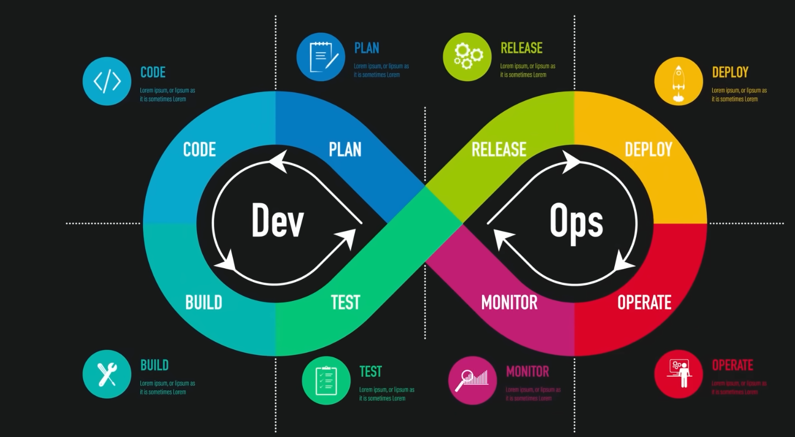
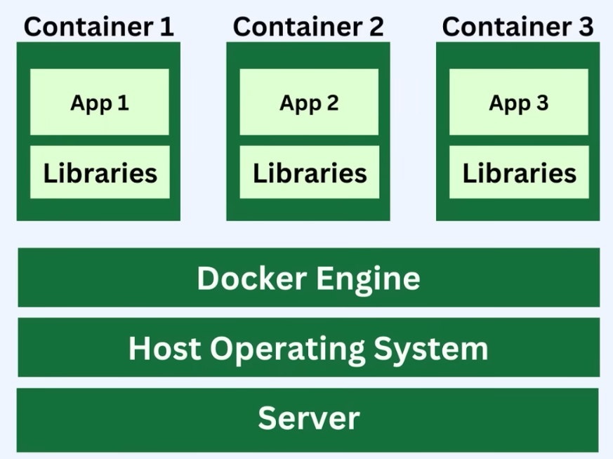
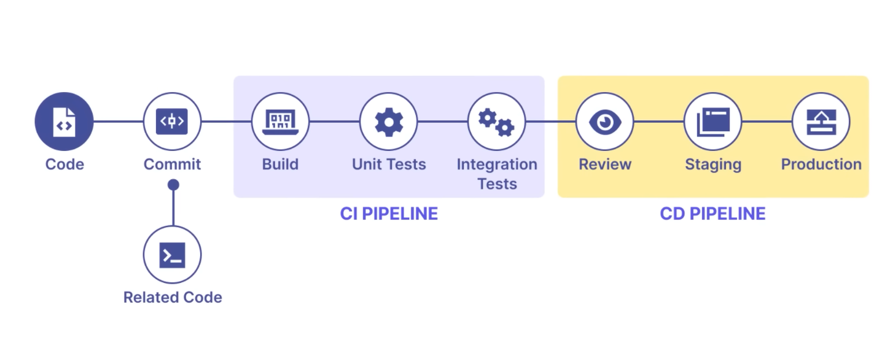
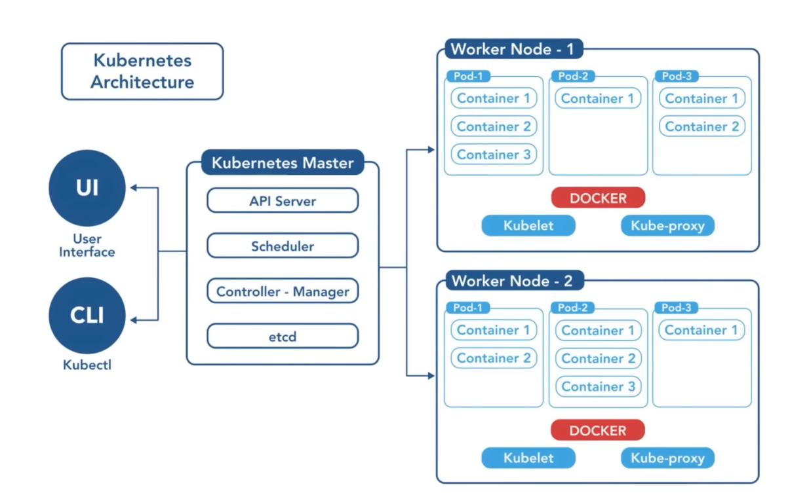
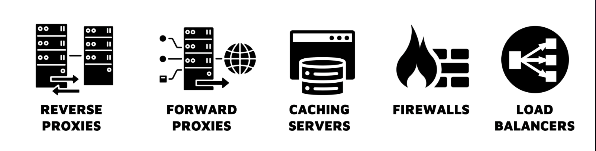
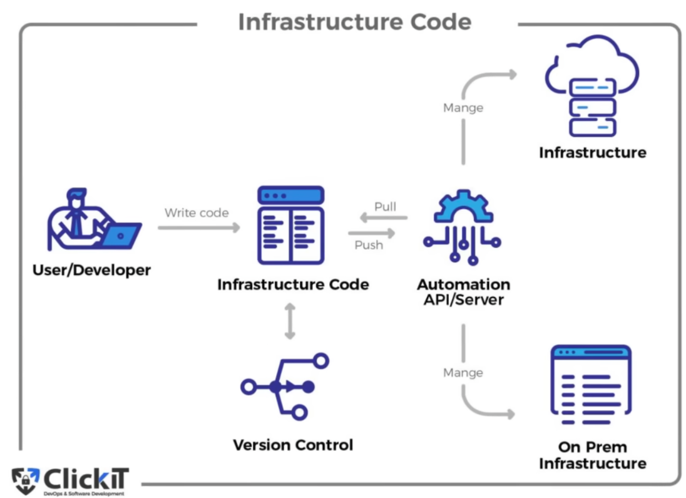
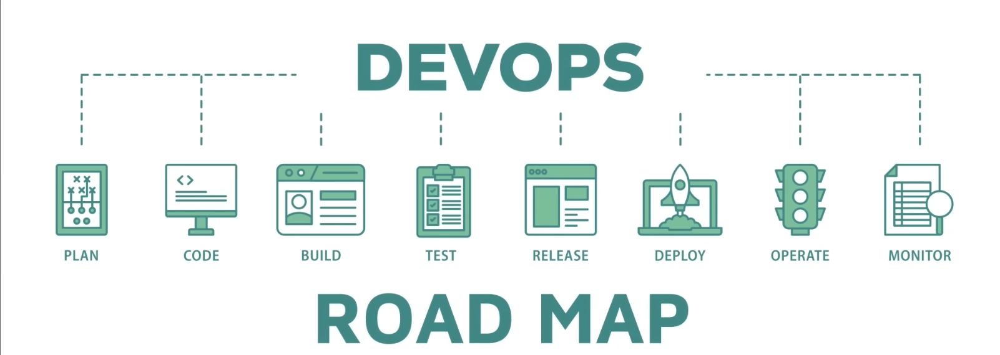

# DevOps Roadmap

If you dedicate **3–5 hours daily**, this roadmap can typically be completed in **10–14 months**.

---

## 1. Linux Essentials (2–3 Weeks)
**Tools:** Bash, ZSH

- File System  
  - `cp`, `mv`, `rm`, `ls`
- Permissions  
  - `chmod`, `chown`
- Processes  
  - `ps`, `top`, `kill`
- Package Managers  
  - `apt`, `yum`, `dnf`

<!--  -->

---

## 2. Networking (2 Weeks)
**Tool:** Wireshark

- OSI and TCP/IP models
- IP Addressing and Subnetting
- DNS and DHCP
- HTTP, HTTPS, FTP, and SSH
- Firewalls and Security Groups
- Tools: `ping`, `traceroute`, `netstat`

<!--  -->

---

## 3. Git (1–2 Weeks)

- `clone`, `commit`, `push`, `pull`
- Branching and Merging
- Resolving Merge Conflicts
- Working with Remote Repositories

<!--  -->

---

## 4. Programming Language (4–6 Weeks)
**Languages:** Python, Ruby, Go

- Syntax and Data Structures
- Modules and Packages
- Writing and Executing Scripts
- Working with Files
- Error Handling
- Automation Script Writing

<!--  -->

---

## 5. Cloud Providers (4–6 Weeks)
**Platforms:** AWS, Azure, GCP

- Launch, Configure, and Manage Virtual Servers
- Manage and Store Data
- Manage Users, Groups, and Roles
- Set up and Manage Isolated Networks

<!--  -->

---

## 6. Containerization (3–4 Weeks)
**Tool:** Docker

- Create Docker Images
- Start, Stop, and Manage Containers
- Write Dockerfiles
- Run Multi-Container Applications using Docker Compose

---

## 7. CI/CD (3–4 Weeks)
**Tools:** Jenkins, GitHub Actions

- Create and Manage Jenkins Pipelines
- Write Jenkinsfiles
- Integrate Automated Tests
- Automate the Build Process
- Automate Deployments

---

## 8. Container Orchestration (4–6 Weeks)
**Tools:** Kubernetes, Kustomize, Helm

- Overall Architecture
- Key Components
- Managing Resources
- Scaling Applications
- Networking Models

---

## 9. Networking & Infrastructure (3–4 Weeks)
**Tool:** NGINX

- Reverse Proxy & Load Balancing
- Configure NGINX as a Reverse Proxy
- Configure Forward Proxy
- Implement Caching Strategies
- Configure Firewall and Security Groups

---

## 10. Configuration Management (3–4 Weeks)
**Tools:** Ansible, Puppet, Chef

- Write Ansible Playbooks
- Use Roles and Modules
- Manage Variables and Templates

---

## 11. Infrastructure as Code (3–4 Weeks)
**Tools:** Terraform, OpenTofu, CloudFormation, Pulumi

- Basic Concepts
- Terraform Configuration Files
- Terraform Modules
- Advanced Concepts

---

## 12. Monitoring & Logging (3–4 Weeks)
**Tools:** Prometheus, Grafana, Loki, ELK Stack, Fluentd

- Architecture and Data Models
- Collect Metrics
- Write Queries
- Set up Alerts

<!--  -->

---

